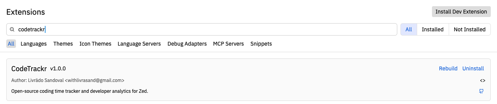
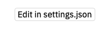

# CodeTrackr for Zed

**Open-source coding analytics and time tracking for developers using Zed, VS Code, Cursor, Windsurf, JetBrains, and more.**

Track your coding activity automatically and see insights on your language usage, projects, and productivity -- directly inside your editor and [CodeTrackr dashboard](https://codetrackr.fly.dev).


## Install
1. `Cmd+Shift+P` -> `zed: extensions`
2. Search for "codetrackr" in the "Extensions" page and click "Install".


## Configuration

### Environment variables (info)

| Variable | Default | Description |
|---|---|---|
| `CODETRACKR_API_KEY` | — | Your CodeTrackr API key (create one at [codetrackr.fly.dev](https://codetrackr.fly.dev)) |
| `CODETRACKR_BASE_URL` | `https://codetrackr.fly.dev` | API base URL (change if using your own deployment) |

### Zed settings

You can also configure the variables via Zed's settings file (`Cmd+Shift+P` -> `zed: open settings` -> `Edit in settings.json`):



```json
{
  "lsp": {
    "codetrackr": {
      "initialization_options": {
        "api_key": "ct_tu_api_key_aqui",
        "base_url": "https://codetrackr.fly.dev"
      }
    }
  }
}
```

Environment variables take precedence over Zed settings.

## Uninstall

1. `Cmd+Shift+P` -> `zed: extensions`
2. Search for **CodeTrackr**
3. Click **Remove**

## Note
This plugin has been thoroughly tested only on macOS. If you encounter any issues on other systems, please submit an issue or a pull request.

CodeTrackr · Deployed on Fly · Powered by Rust · Open source (AGPL-3.0)

Made by [Livrädo Sandoval](https://github.com/livrasand) and the CodeTrackr community.
